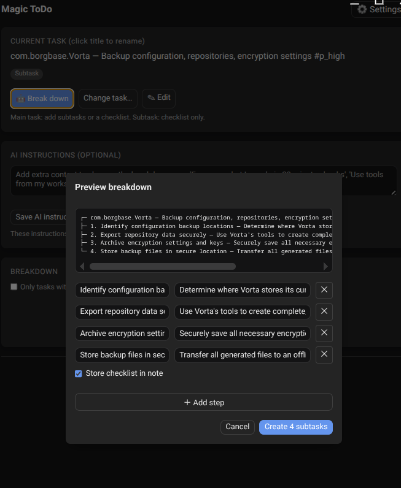
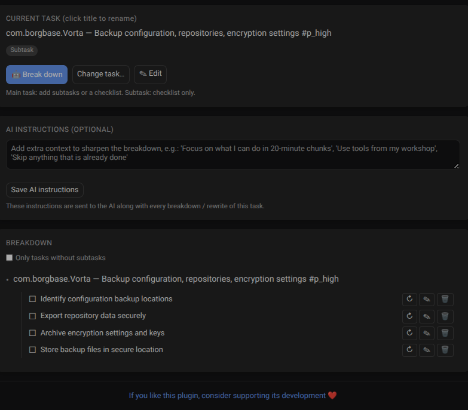

# Magic ToDo Plugin for Super Productivity

Break tasks into subtasks with an OpenAI-compatible AI endpoint. Up to 3 levels: task, subtasks, and checklist sub-subtasks.

The extension is inspired by Goblin Tools. 
## screenshots

## Installation

1. Download `magic-todo-plugin.zip`
2. Open **Super Productivity** → Settings → Plugins → Import Plugin
3. Select the zip file
4. Restart the app if prompted

## Usage

- **Side panel**: Opens automatically after import. Select a task and click "Break Down with AI" to generate subtasks.
- **Header button**: click the magic icon to open the side panel.
- **Keyboard shortcut**: press `Ctrl+Shift+M` to open the side panel.
- **AI endpoint**: configure your OpenAI-compatible API endpoint and key in the side panel settings.
- **Subtasks**: generated subtasks can be added as child tasks or as checklist items inside the task notes.

## How It Works

- Uses the OpenAI-compatible chat completions API to break a task into smaller steps.
- Supports up to 3 levels of nesting: task → subtask → checklist sub-subtask.
- Persists API settings in plugin synced storage.

## License

This project is licensed under the Cooperative Nonviolence License (CNVL) - see the [LICENSE](LICENSE) file for details.

## Support

If you find this plugin useful, please consider supporting its development:

## Files

- `manifest.json` — plugin metadata, permissions, hooks
- `plugin.js` — host-side logic, API calls, subtask generation
- `index.html` — iframe-side side panel UI
- `LICENSE` — MIT License
